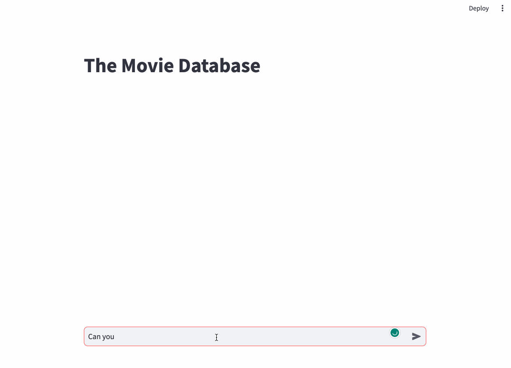

# MovieBot

This is a proof-of-concept [Retrieval Augmented generation](https://ai.meta.com/blog/retrieval-augmented-generation-streamlining-the-creation-of-intelligent-natural-language-processing-models/) (RAG) chatbot to chat about the most popular movies in a movie database.



The system uses:

- Redis Stack as a Vector Database to store the dataset and vectorize the entries to perform [Vector Similarity Search (VSS)](https://redis.io/docs/interact/search-and-query/search/vectors/) for RAG
- The [IMDB movies dataset](https://www.kaggle.com/datasets/ashpalsingh1525/imdb-movies-dataset), which contains 10000+ movies from the IMDB Movies dataset
- OpenAI ChatGPT Large Language Model (LLM) [ChatCompletion API](https://platform.openai.com/docs/guides/gpt/chat-completions-api), and concretely the model `gpt-3.5-turbo-0613`
- Streamlit chat's elements, useful for building [conversational apps](https://docs.streamlit.io/knowledge-base/tutorials/build-conversational-apps)


## Setup

Make sure you have an [OpenAI token](https://text-gen.com/get-openai-access-token) and then set the following environment variables (you can use the defaults indicated, but make sure to specify your OpenAI token):

```commandline
export DATA_PATH="./src/data/imdb_movies.csv" VSS_MINIMUM_SCORE=5 VSS_RESULTS=3 REDIS_URL="redis://redis:6379" OPENAI_MODEL = "gpt-3.5-turbo-0613" OPENAI_API_KEY=<YOUR_TOKEN_HERE>
```

1. Install Redis Stack using your favorite [installation method](https://redis.io/docs/getting-started/install-stack/). If you like Docker, you can get it with `docker run -d --name redis-stack-server -p 6379:6379 redis/redis-stack-server:latest`
2. Clone this repository `git clone https://github.com/mortensi/moviebot.git`
3. Install the requirements `pip install -r requirements.txt`
4. Run the server with `streamlit run src/main.py`. If it is starting for the first time, it'll take a few minutes to index the dataset; you can review the log file as indexing progresses. Subsequent restarts will be immediate (controlled by the key `moviebot:status`, [delete](https://redis.io/commands/del/) it to override an installation).
5. Ask questions about actors, movies and get recommendations!


## Implementation

This project uses Redis as a Vector Database to store movies entries in JSON format. Once the import from the provided CSV dataset is complete, you can browse the database using the [JSON.GET](https://redis.io/commands/json.get/) command (start `redis-cli` first with the `--raw` argument to produce pretty-formatted JSON):

```commandline
$ redis-cli --raw
127.0.0.1:6379> JSON.GET moviebot:movie:7185 $.names $.overview $.crew
{"$.overview":["A mysterious virus hits an isolated elementary school, transforming the kids into a feral swarm of mass savages. An unlikely hero must lead a motley band of teachers in the fight of their lives."],"$.crew":["Elijah Wood, Clint, Alison Pill, Lucy, Rainn Wilson, Wade, Jack McBrayer, Tracy, Nasim Pedrad, Rebekkah, Leigh Whannell, Doug, Morgan Lily, Tamra, Rebecca Marshall, Emily Dopkins, Jorge Garcia, Rick"],"$.names":["Cooties"]}
```

Indexing is done with the [FT.CREATE](https://redis.io/commands/ft.create/) command and queries are performed using the [FT.SEARCH](https://redis.io/commands/ft.search/) command.

RAG behavior is pretty basic, when you ask a question to the chatbot the following happens:

1. Your question is vectorized, and the most similar entries in the database are retrieved using VSS range search
2. Collect the information from the best matches, and build a prompt for the ChatCompletion API
3. The response from OpenAI servers is collected and displayed to the user
4. The interaction is saved in the database, in a [Redis Stream](https://redis.io/docs/data-types/streams/). You can inspect the interactions using `XRANGE moviebot:conversation - +` 

A sample prompt is:

```
'''Use the provided information to answer the search query the user has sent.
    The information in the database provides three movies, chose the one or the ones that fit most.
    If you can't answer the user's question, say "Sorry, I am unable to answer the question, try to refine your question". Do not guess. You must deduce the answer exclusively from the information provided. 
    The answer must be formatted in markdown or HTML.
    Do not make things up. Do not add personal opinions. Do not add any disclaimer.

    Search query: 

    {}

    Information in the database: 

    {}
    '''
```

Remember that you can interact with your Redis Stack database using [RedisInsight](https://redis.com/redis-enterprise/redis-insight/), you will love it!